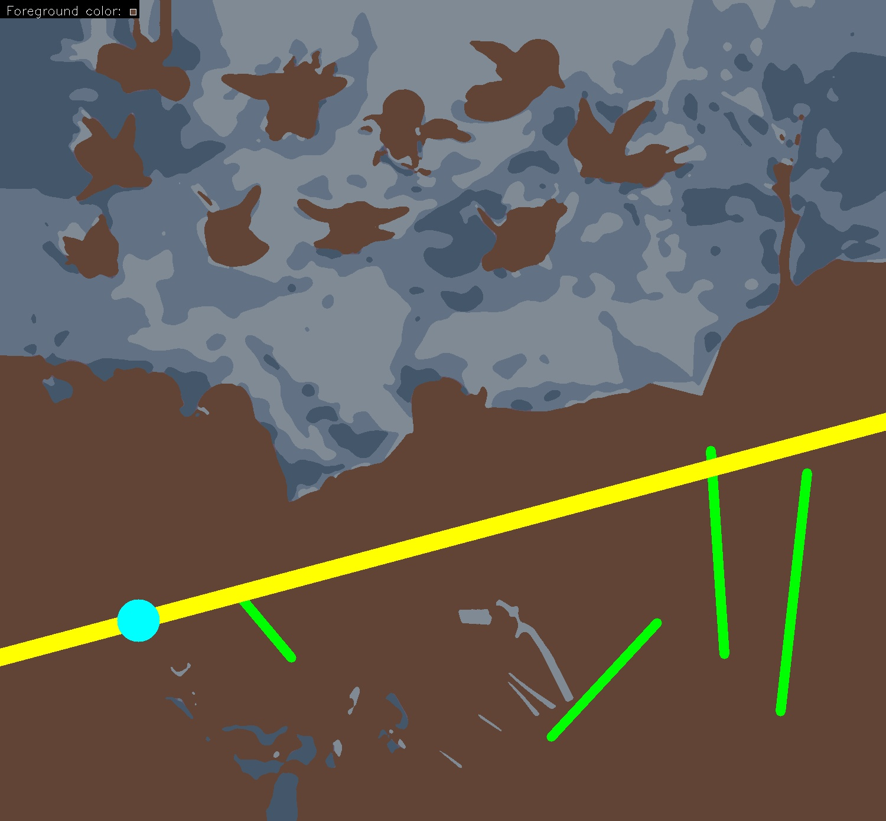

# Unsupervised Approach to Uncovering Underlying Compositions in Art History

## Expected Results

| wikimedia.org: Giotto, Lower Church Assisi, The Visitation 01.jpg  | Our Result |
| ------------- | ------------- |
|   |  |
| wikimedia.org: Giotto di Bondone 009.jpg | Our Result |
|   |  |

## Usage & Installation with Docker
In this example we analyse 3 Images from wikimedia.org (input_image folder) and place the output image composition canvas in the results folder.
```bash
git clone https://github.com/image-compostion-canvas-group/image-compostion-canvas
cd image-compostion-canvas
rm results && mkdir results
mkdir input_images
cd input_images
wget https://upload.wikimedia.org/wikipedia/commons/3/3e/Giotto%2C_Lower_Church_Assisi%2C_The_Visitation_01.jpg
wget https://upload.wikimedia.org/wikipedia/commons/a/a9/Giotto_di_Bondone_009.jpg
wget https://upload.wikimedia.org/wikipedia/commons/f/f9/Giotto_-_Scrovegni_-_-18-_-_Adoration_of_the_Magi.jpg
cd ..
docker build . -t image-composition-canvas
docker run --rm -it -v "`pwd`/input_images:/images/in" -v "`pwd`/results:/images/out" image-composition-canvas
ll results
```

## Usage with non Docker
Important: replace all pathes with your own path to your local instalation. Always use absolute pathes to avoid problems.
### Installation
Tested with `Python 3.7.5`, `pip 19.3.1` on `macOS 10.15`.

* Optional: Create a virtual environment, to avoid version conflicts with previously installed packages:
```bash
git clone https://github.com/image-compostion-canvas-group/image-compostion-canvas
cd image-compostion-canvas
virtualenv .venv
source .venv/bin/activate
``` 
* If you skip the virtual env. Clone the repo with `git clone https://github.com/image-compostion-canvas-group/image-compostion-canvas`
* Install and build OpenPose with python bindings (including OpenCV), for details see [official instructions](https://github.com/CMU-Perceptual-Computing-Lab/openpose/blob/master/doc/installation.md#installation). You can install openpose at any location of your computer and set the path to your installation in the next step.
* make sure to append the openpose python bindings to your python path and to set env var for openpose models. Make sure to replace `/path/to/openpose` with the absolute path to your openpose installation from the step above. Keep `/build/python` and `/models/` in this path.
```bash
export PYTHONPATH="/path/to/openpose/build/python:$PYTHONPATH"
export OPENPOSE_MODELS="/path/to/openpose/models/"
```
* install all python dependencies:
```bash
pip install -r requirements.txt
```

### Usage
* make sure you have set all env vars from installation step
* prepare a folder with images as input folder. Make sure there are only images inside the folder, otherwise the script will crash. For example some images from wikimedia:
```bash
mkdir input_images
cd input_images
wget https://upload.wikimedia.org/wikipedia/commons/3/3e/Giotto%2C_Lower_Church_Assisi%2C_The_Visitation_01.jpg
wget https://upload.wikimedia.org/wikipedia/commons/a/a9/Giotto_di_Bondone_009.jpg
wget https://upload.wikimedia.org/wikipedia/commons/f/f9/Giotto_-_Scrovegni_-_-18-_-_Adoration_of_the_Magi.jpg
```
* change the flags in detect_structures.py to specify the output format you want
* start the main script, specify `IN_DIR` (folder with input images) and `OUT_DIR` for the results: `IN_DIR="/path/to/folder/with/input/images" OUT_DIR="/output/folder/with/results" python detect_structures.py`
